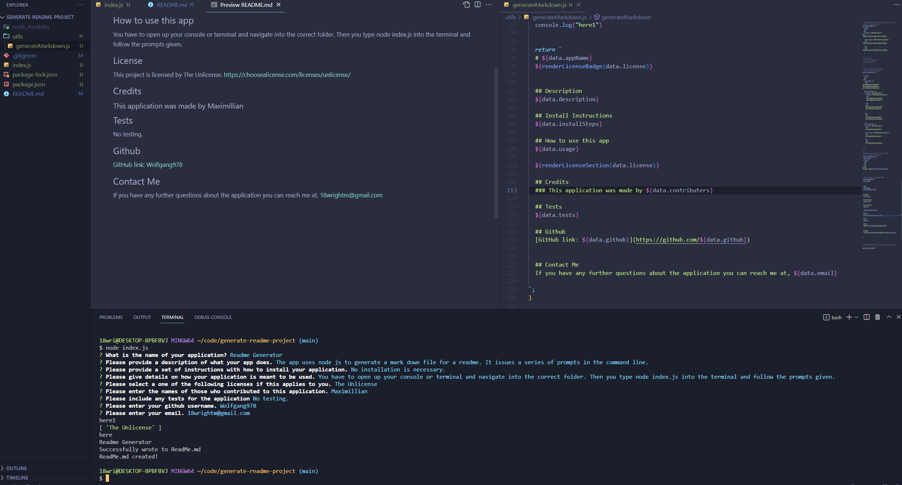

  # Readme Generator
  

          
  
  
  ## Description
  The app uses node js to generate a mark down file for a readme. It issues a series of prompts in the command line.
  
  ## Install Instructions
  No installation is necessary.
  
  ## How to use this app
  You have to open up your console or terminal and navigate into the correct folder. Then you type node index.js into the terminal and follow the prompts given.
  
  
## License
This project is licensed by The Unlicense. 
        https://choosealicense.com/licenses/unlicense/
        
    
  
  ## Credits
  ### This application was made by Maximillian

  ## Tests
  No testing.

  ## Github
  [GitHub link: Wolfgang978](https://github.com/Wolfgang978)
  
  
  ## Contact Me
  If you have any further questions about the application you can reach me at, 18wrightm@gmail.com

  ## Screenshot
  
 

